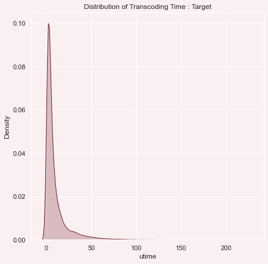
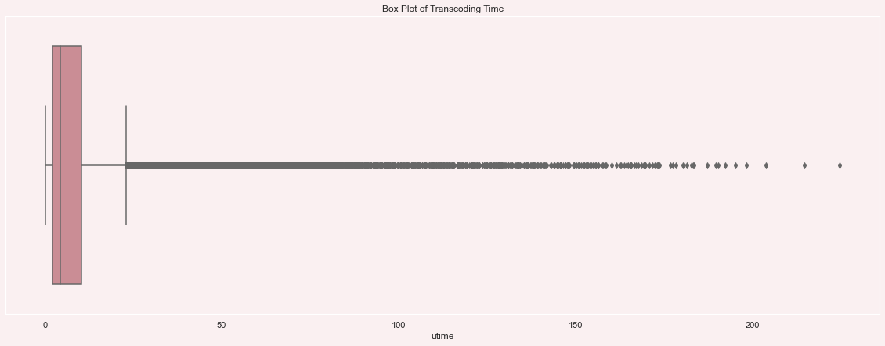
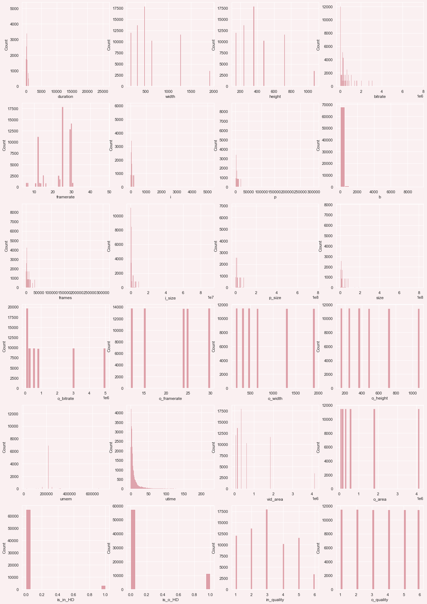
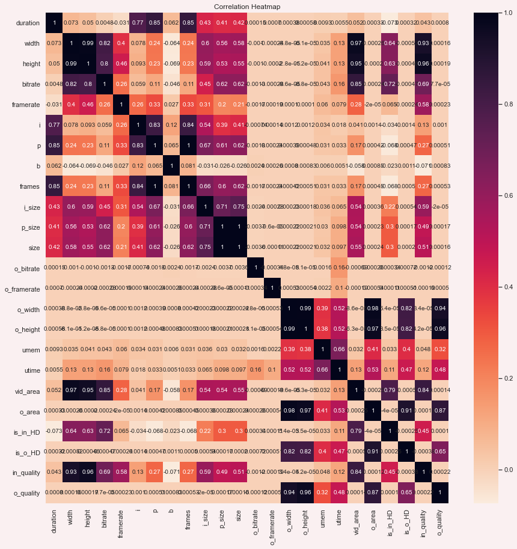
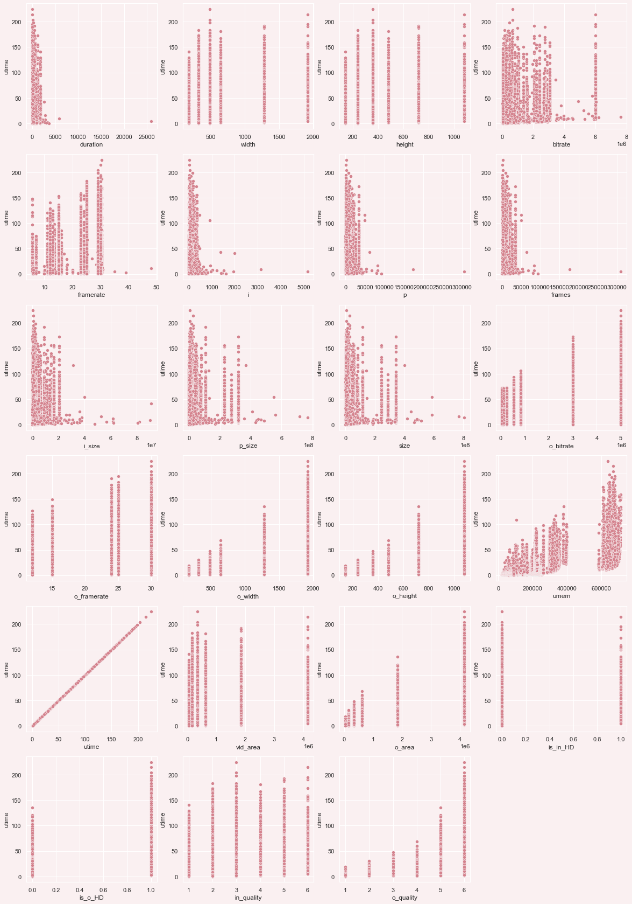
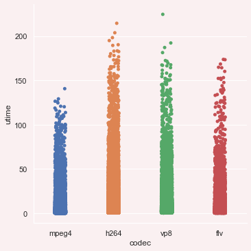
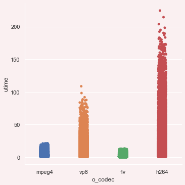
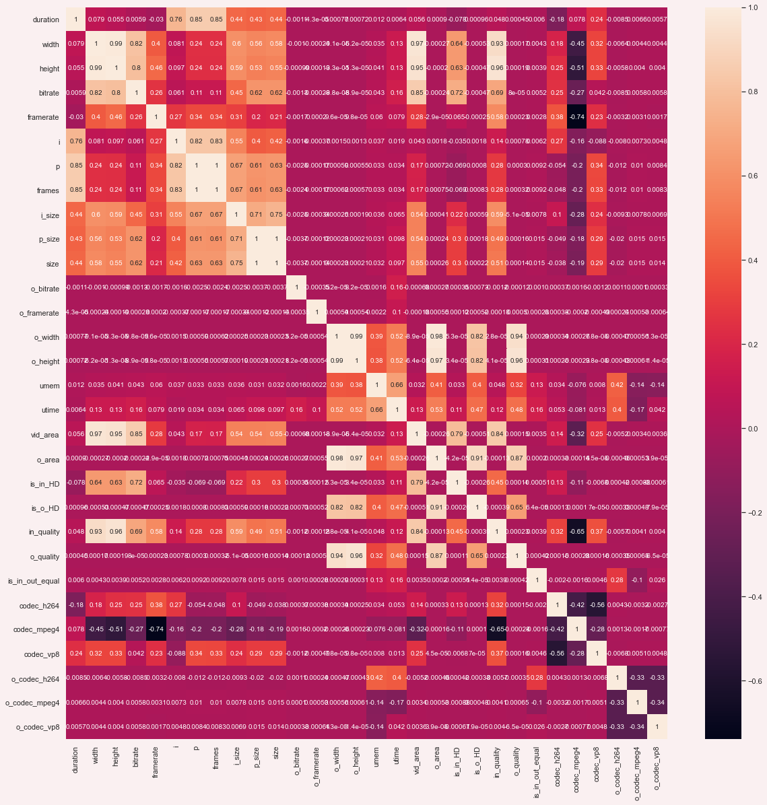

<h1>Table of Contents<span class="tocSkip"></span></h1>
<div class="toc"><ul class="toc-item"><li><span><a href="#Importing-Modules" data-toc-modified-id="Importing-Modules-1"><span class="toc-item-num">1&nbsp;&nbsp;</span>Importing Modules</a></span><ul class="toc-item"><li><span><a href="#Global-Commands" data-toc-modified-id="Global-Commands-1.1"><span class="toc-item-num">1.1&nbsp;&nbsp;</span>Global Commands</a></span></li></ul></li><li><span><a href="#Data-Preprocesing" data-toc-modified-id="Data-Preprocesing-2"><span class="toc-item-num">2&nbsp;&nbsp;</span>Data Preprocesing</a></span><ul class="toc-item"><li><span><a href="#Loading-the-Data-and-Data-Descriptions" data-toc-modified-id="Loading-the-Data-and-Data-Descriptions-2.1"><span class="toc-item-num">2.1&nbsp;&nbsp;</span>Loading the Data and Data Descriptions</a></span></li><li><span><a href="#Data-Cleaning" data-toc-modified-id="Data-Cleaning-2.2"><span class="toc-item-num">2.2&nbsp;&nbsp;</span>Data Cleaning</a></span></li><li><span><a href="#Feature-Engineering---Brainstorming" data-toc-modified-id="Feature-Engineering---Brainstorming-2.3"><span class="toc-item-num">2.3&nbsp;&nbsp;</span>Feature Engineering - Brainstorming</a></span></li><li><span><a href="#Splitting-Categorical-and-Numerical-Data" data-toc-modified-id="Splitting-Categorical-and-Numerical-Data-2.4"><span class="toc-item-num">2.4&nbsp;&nbsp;</span>Splitting Categorical and Numerical Data</a></span></li></ul></li><li><span><a href="#Analytics" data-toc-modified-id="Analytics-3"><span class="toc-item-num">3&nbsp;&nbsp;</span>Analytics</a></span><ul class="toc-item"><li><span><a href="#Target-Feature-Analytics" data-toc-modified-id="Target-Feature-Analytics-3.1"><span class="toc-item-num">3.1&nbsp;&nbsp;</span>Target Feature Analytics</a></span><ul class="toc-item"><li><span><a href="#Observations" data-toc-modified-id="Observations-3.1.1"><span class="toc-item-num">3.1.1&nbsp;&nbsp;</span>Observations</a></span></li><li><span><a href="#Steps-to-be-taken" data-toc-modified-id="Steps-to-be-taken-3.1.2"><span class="toc-item-num">3.1.2&nbsp;&nbsp;</span>Steps to be taken</a></span></li></ul></li><li><span><a href="#Numerical-Features---Analytics" data-toc-modified-id="Numerical-Features---Analytics-3.2"><span class="toc-item-num">3.2&nbsp;&nbsp;</span>Numerical Features - Analytics</a></span><ul class="toc-item"><li><span><a href="#Skewness" data-toc-modified-id="Skewness-3.2.1"><span class="toc-item-num">3.2.1&nbsp;&nbsp;</span>Skewness</a></span></li><li><span><a href="#Corelations" data-toc-modified-id="Corelations-3.2.2"><span class="toc-item-num">3.2.2&nbsp;&nbsp;</span>Corelations</a></span></li><li><span><a href="#Numerical-Features-with-Target" data-toc-modified-id="Numerical-Features-with-Target-3.2.3"><span class="toc-item-num">3.2.3&nbsp;&nbsp;</span>Numerical Features with Target</a></span></li><li><span><a href="#Observations" data-toc-modified-id="Observations-3.2.4"><span class="toc-item-num">3.2.4&nbsp;&nbsp;</span>Observations</a></span></li></ul></li><li><span><a href="#Categorical-Features-Analytics" data-toc-modified-id="Categorical-Features-Analytics-3.3"><span class="toc-item-num">3.3&nbsp;&nbsp;</span>Categorical Features Analytics</a></span><ul class="toc-item"><li><span><a href="#Codec-and-Transcoding-Time" data-toc-modified-id="Codec-and-Transcoding-Time-3.3.1"><span class="toc-item-num">3.3.1&nbsp;&nbsp;</span>Codec and Transcoding Time</a></span></li><li><span><a href="#o_codec-and-Transcoding-Time" data-toc-modified-id="o_codec-and-Transcoding-Time-3.3.2"><span class="toc-item-num">3.3.2&nbsp;&nbsp;</span>o_codec and Transcoding Time</a></span></li></ul></li></ul></li><li><span><a href="#Data-Transformations" data-toc-modified-id="Data-Transformations-4"><span class="toc-item-num">4&nbsp;&nbsp;</span>Data Transformations</a></span><ul class="toc-item"><li><span><a href="#Encoding-Data" data-toc-modified-id="Encoding-Data-4.1"><span class="toc-item-num">4.1&nbsp;&nbsp;</span>Encoding Data</a></span></li><li><span><a href="#Feature-Selection" data-toc-modified-id="Feature-Selection-4.2"><span class="toc-item-num">4.2&nbsp;&nbsp;</span>Feature Selection</a></span><ul class="toc-item"><li><span><a href="#Removing-Multicollinear-features" data-toc-modified-id="Removing-Multicollinear-features-4.2.1"><span class="toc-item-num">4.2.1&nbsp;&nbsp;</span>Removing Multicollinear features</a></span></li></ul></li><li><span><a href="#Train-Test-Split-and-Feature-Handling" data-toc-modified-id="Train-Test-Split-and-Feature-Handling-4.3"><span class="toc-item-num">4.3&nbsp;&nbsp;</span>Train Test Split and Feature Handling</a></span><ul class="toc-item"><li><span><a href="#Scaling-and-Normalizing-The-Data" data-toc-modified-id="Scaling-and-Normalizing-The-Data-4.3.1"><span class="toc-item-num">4.3.1&nbsp;&nbsp;</span>Scaling and Normalizing The Data</a></span></li></ul></li><li><span><a href="#Model-Building" data-toc-modified-id="Model-Building-4.4"><span class="toc-item-num">4.4&nbsp;&nbsp;</span>Model Building</a></span><ul class="toc-item"><li><span><a href="#Training-and-Test-Data-Initializations" data-toc-modified-id="Training-and-Test-Data-Initializations-4.4.1"><span class="toc-item-num">4.4.1&nbsp;&nbsp;</span>Training and Test Data Initializations</a></span></li><li><span><a href="#Model-Building----Selection" data-toc-modified-id="Model-Building----Selection-4.4.2"><span class="toc-item-num">4.4.2&nbsp;&nbsp;</span>Model Building -  Selection</a></span></li><li><span><a href="#Evaluating-The-Models" data-toc-modified-id="Evaluating-The-Models-4.4.3"><span class="toc-item-num">4.4.3&nbsp;&nbsp;</span>Evaluating The Models</a></span></li></ul></li><li><span><a href="#Final-Model" data-toc-modified-id="Final-Model-4.5"><span class="toc-item-num">4.5&nbsp;&nbsp;</span>Final Model</a></span><ul class="toc-item"><li><span><a href="#Saving-the-models" data-toc-modified-id="Saving-the-models-4.5.1"><span class="toc-item-num">4.5.1&nbsp;&nbsp;</span>Saving the models</a></span></li></ul></li></ul></li><li><span><a href="#Notes:" data-toc-modified-id="Notes:-5"><span class="toc-item-num">5&nbsp;&nbsp;</span>Notes:</a></span></li></ul></div>

# Importing Modules


```python
import time
import pickle
import numpy as np
import pandas as pd
import matplotlib.pyplot as plt
import seaborn as sns
from scipy import stats as ss
from sklearn.metrics import mean_absolute_error
from sklearn.model_selection import train_test_split, GridSearchCV
from sklearn.preprocessing import MinMaxScaler
from sklearn.linear_model import LinearRegression, SGDRegressor
from sklearn.svm import SVR
from sklearn.tree import DecisionTreeRegressor
from xgboost import XGBRegressor, XGBRFRegressor
from sklearn.ensemble import RandomForestRegressor, GradientBoostingRegressor
from matplotlib import colors
import warnings

```

## Global Commands


```python
pd.set_option('display.max_columns', None)
warnings.filterwarnings("ignore")
%matplotlib inline
sns.set_theme(style="darkgrid")
palette = ["#96996A","#5B6154","#D19F7C","#A1756A","#DEC2BE"]
```

# Data Preprocesing

## Loading the Data and Data Descriptions


```python
data = pd.read_csv("transcoding_mesurment.tsv", sep="\t")
print("No of Datapoints:", len(data))
data.head()
```

    No of Datapoints: 68784
    


<div>
<style scoped>
    .dataframe tbody tr th:only-of-type {
        vertical-align: middle;
    }

    .dataframe tbody tr th {
        vertical-align: top;
    }

    .dataframe thead th {
        text-align: right;
    }
</style>
<table border="1" class="dataframe">
  <thead>
    <tr style="text-align: right;">
      <th></th>
      <th>id</th>
      <th>duration</th>
      <th>codec</th>
      <th>width</th>
      <th>height</th>
      <th>bitrate</th>
      <th>framerate</th>
      <th>i</th>
      <th>p</th>
      <th>b</th>
      <th>frames</th>
      <th>i_size</th>
      <th>p_size</th>
      <th>b_size</th>
      <th>size</th>
      <th>o_codec</th>
      <th>o_bitrate</th>
      <th>o_framerate</th>
      <th>o_width</th>
      <th>o_height</th>
      <th>umem</th>
      <th>utime</th>
    </tr>
  </thead>
  <tbody>
    <tr>
      <th>0</th>
      <td>04t6-jw9czg</td>
      <td>130.35667</td>
      <td>mpeg4</td>
      <td>176</td>
      <td>144</td>
      <td>54590</td>
      <td>12.0</td>
      <td>27</td>
      <td>1537</td>
      <td>0</td>
      <td>1564</td>
      <td>64483</td>
      <td>825054</td>
      <td>0</td>
      <td>889537</td>
      <td>mpeg4</td>
      <td>56000</td>
      <td>12.0</td>
      <td>176</td>
      <td>144</td>
      <td>22508</td>
      <td>0.612</td>
    </tr>
    <tr>
      <th>1</th>
      <td>04t6-jw9czg</td>
      <td>130.35667</td>
      <td>mpeg4</td>
      <td>176</td>
      <td>144</td>
      <td>54590</td>
      <td>12.0</td>
      <td>27</td>
      <td>1537</td>
      <td>0</td>
      <td>1564</td>
      <td>64483</td>
      <td>825054</td>
      <td>0</td>
      <td>889537</td>
      <td>mpeg4</td>
      <td>56000</td>
      <td>12.0</td>
      <td>320</td>
      <td>240</td>
      <td>25164</td>
      <td>0.980</td>
    </tr>
    <tr>
      <th>2</th>
      <td>04t6-jw9czg</td>
      <td>130.35667</td>
      <td>mpeg4</td>
      <td>176</td>
      <td>144</td>
      <td>54590</td>
      <td>12.0</td>
      <td>27</td>
      <td>1537</td>
      <td>0</td>
      <td>1564</td>
      <td>64483</td>
      <td>825054</td>
      <td>0</td>
      <td>889537</td>
      <td>mpeg4</td>
      <td>56000</td>
      <td>12.0</td>
      <td>480</td>
      <td>360</td>
      <td>29228</td>
      <td>1.216</td>
    </tr>
    <tr>
      <th>3</th>
      <td>04t6-jw9czg</td>
      <td>130.35667</td>
      <td>mpeg4</td>
      <td>176</td>
      <td>144</td>
      <td>54590</td>
      <td>12.0</td>
      <td>27</td>
      <td>1537</td>
      <td>0</td>
      <td>1564</td>
      <td>64483</td>
      <td>825054</td>
      <td>0</td>
      <td>889537</td>
      <td>mpeg4</td>
      <td>56000</td>
      <td>12.0</td>
      <td>640</td>
      <td>480</td>
      <td>34316</td>
      <td>1.692</td>
    </tr>
    <tr>
      <th>4</th>
      <td>04t6-jw9czg</td>
      <td>130.35667</td>
      <td>mpeg4</td>
      <td>176</td>
      <td>144</td>
      <td>54590</td>
      <td>12.0</td>
      <td>27</td>
      <td>1537</td>
      <td>0</td>
      <td>1564</td>
      <td>64483</td>
      <td>825054</td>
      <td>0</td>
      <td>889537</td>
      <td>mpeg4</td>
      <td>56000</td>
      <td>12.0</td>
      <td>1280</td>
      <td>720</td>
      <td>58528</td>
      <td>3.456</td>
    </tr>
  </tbody>
</table>
</div>


```python
#Qucik data info
data.info()
```

    <class 'pandas.core.frame.DataFrame'>
    RangeIndex: 68784 entries, 0 to 68783
    Data columns (total 22 columns):
     #   Column       Non-Null Count  Dtype  
    ---  ------       --------------  -----  
     0   id           68784 non-null  object 
     1   duration     68784 non-null  float64
     2   codec        68784 non-null  object 
     3   width        68784 non-null  int64  
     4   height       68784 non-null  int64  
     5   bitrate      68784 non-null  int64  
     6   framerate    68784 non-null  float64
     7   i            68784 non-null  int64  
     8   p            68784 non-null  int64  
     9   b            68784 non-null  int64  
     10  frames       68784 non-null  int64  
     11  i_size       68784 non-null  int64  
     12  p_size       68784 non-null  int64  
     13  b_size       68784 non-null  int64  
     14  size         68784 non-null  int64  
     15  o_codec      68784 non-null  object 
     16  o_bitrate    68784 non-null  int64  
     17  o_framerate  68784 non-null  float64
     18  o_width      68784 non-null  int64  
     19  o_height     68784 non-null  int64  
     20  umem         68784 non-null  int64  
     21  utime        68784 non-null  float64
    dtypes: float64(4), int64(15), object(3)
    memory usage: 11.5+ MB
    


```python
#Description of the data
data.describe().T
```


<div>
<style scoped>
    .dataframe tbody tr th:only-of-type {
        vertical-align: middle;
    }

    .dataframe tbody tr th {
        vertical-align: top;
    }

    .dataframe thead th {
        text-align: right;
    }
</style>
<table border="1" class="dataframe">
  <thead>
    <tr style="text-align: right;">
      <th></th>
      <th>count</th>
      <th>mean</th>
      <th>std</th>
      <th>min</th>
      <th>25%</th>
      <th>50%</th>
      <th>75%</th>
      <th>max</th>
    </tr>
  </thead>
  <tbody>
    <tr>
      <th>duration</th>
      <td>68784.0</td>
      <td>2.864139e+02</td>
      <td>2.872576e+02</td>
      <td>31.080000</td>
      <td>106.765</td>
      <td>2.391417e+02</td>
      <td>3.793200e+02</td>
      <td>2.584409e+04</td>
    </tr>
    <tr>
      <th>width</th>
      <td>68784.0</td>
      <td>6.249342e+02</td>
      <td>4.631691e+02</td>
      <td>176.000000</td>
      <td>320.000</td>
      <td>4.800000e+02</td>
      <td>6.400000e+02</td>
      <td>1.920000e+03</td>
    </tr>
    <tr>
      <th>height</th>
      <td>68784.0</td>
      <td>4.125722e+02</td>
      <td>2.406155e+02</td>
      <td>144.000000</td>
      <td>240.000</td>
      <td>3.600000e+02</td>
      <td>4.800000e+02</td>
      <td>1.080000e+03</td>
    </tr>
    <tr>
      <th>bitrate</th>
      <td>68784.0</td>
      <td>6.937015e+05</td>
      <td>1.095628e+06</td>
      <td>8384.000000</td>
      <td>134334.000</td>
      <td>2.911500e+05</td>
      <td>6.529670e+05</td>
      <td>7.628466e+06</td>
    </tr>
    <tr>
      <th>framerate</th>
      <td>68784.0</td>
      <td>2.324132e+01</td>
      <td>7.224848e+00</td>
      <td>5.705752</td>
      <td>15.000</td>
      <td>2.502174e+01</td>
      <td>2.900000e+01</td>
      <td>4.800000e+01</td>
    </tr>
    <tr>
      <th>i</th>
      <td>68784.0</td>
      <td>1.008683e+02</td>
      <td>8.476479e+01</td>
      <td>7.000000</td>
      <td>39.000</td>
      <td>8.000000e+01</td>
      <td>1.380000e+02</td>
      <td>5.170000e+03</td>
    </tr>
    <tr>
      <th>p</th>
      <td>68784.0</td>
      <td>6.531692e+03</td>
      <td>6.075872e+03</td>
      <td>175.000000</td>
      <td>2374.000</td>
      <td>5.515000e+03</td>
      <td>9.155000e+03</td>
      <td>3.049590e+05</td>
    </tr>
    <tr>
      <th>b</th>
      <td>68784.0</td>
      <td>9.147854e+00</td>
      <td>9.251618e+01</td>
      <td>0.000000</td>
      <td>0.000</td>
      <td>0.000000e+00</td>
      <td>0.000000e+00</td>
      <td>9.407000e+03</td>
    </tr>
    <tr>
      <th>frames</th>
      <td>68784.0</td>
      <td>6.641708e+03</td>
      <td>6.153342e+03</td>
      <td>192.000000</td>
      <td>2417.000</td>
      <td>5.628000e+03</td>
      <td>9.232000e+03</td>
      <td>3.101290e+05</td>
    </tr>
    <tr>
      <th>i_size</th>
      <td>68784.0</td>
      <td>2.838987e+06</td>
      <td>4.325137e+06</td>
      <td>11648.000000</td>
      <td>393395.000</td>
      <td>9.458650e+05</td>
      <td>3.392479e+06</td>
      <td>9.082855e+07</td>
    </tr>
    <tr>
      <th>p_size</th>
      <td>68784.0</td>
      <td>2.218057e+07</td>
      <td>5.097306e+07</td>
      <td>33845.000000</td>
      <td>1851539.000</td>
      <td>6.166260e+06</td>
      <td>1.515506e+07</td>
      <td>7.689970e+08</td>
    </tr>
    <tr>
      <th>b_size</th>
      <td>68784.0</td>
      <td>0.000000e+00</td>
      <td>0.000000e+00</td>
      <td>0.000000</td>
      <td>0.000</td>
      <td>0.000000e+00</td>
      <td>0.000000e+00</td>
      <td>0.000000e+00</td>
    </tr>
    <tr>
      <th>size</th>
      <td>68784.0</td>
      <td>2.502294e+07</td>
      <td>5.414402e+07</td>
      <td>191879.000000</td>
      <td>2258222.000</td>
      <td>7.881069e+06</td>
      <td>1.977335e+07</td>
      <td>8.067111e+08</td>
    </tr>
    <tr>
      <th>o_bitrate</th>
      <td>68784.0</td>
      <td>1.395036e+06</td>
      <td>1.749352e+06</td>
      <td>56000.000000</td>
      <td>109000.000</td>
      <td>5.390000e+05</td>
      <td>3.000000e+06</td>
      <td>5.000000e+06</td>
    </tr>
    <tr>
      <th>o_framerate</th>
      <td>68784.0</td>
      <td>2.119086e+01</td>
      <td>6.668703e+00</td>
      <td>12.000000</td>
      <td>15.000</td>
      <td>2.400000e+01</td>
      <td>2.500000e+01</td>
      <td>2.997000e+01</td>
    </tr>
    <tr>
      <th>o_width</th>
      <td>68784.0</td>
      <td>8.023364e+02</td>
      <td>6.099598e+02</td>
      <td>176.000000</td>
      <td>320.000</td>
      <td>4.800000e+02</td>
      <td>1.280000e+03</td>
      <td>1.920000e+03</td>
    </tr>
    <tr>
      <th>o_height</th>
      <td>68784.0</td>
      <td>5.038255e+02</td>
      <td>3.159704e+02</td>
      <td>144.000000</td>
      <td>240.000</td>
      <td>3.600000e+02</td>
      <td>7.200000e+02</td>
      <td>1.080000e+03</td>
    </tr>
    <tr>
      <th>umem</th>
      <td>68784.0</td>
      <td>2.282247e+05</td>
      <td>9.743088e+04</td>
      <td>22508.000000</td>
      <td>216820.000</td>
      <td>2.194800e+05</td>
      <td>2.196560e+05</td>
      <td>7.118240e+05</td>
    </tr>
    <tr>
      <th>utime</th>
      <td>68784.0</td>
      <td>9.996355e+00</td>
      <td>1.610743e+01</td>
      <td>0.184000</td>
      <td>2.096</td>
      <td>4.408000e+00</td>
      <td>1.043300e+01</td>
      <td>2.245740e+02</td>
    </tr>
  </tbody>
</table>
</div>


## Data Cleaning


```python
unwanted_cols = ["b_size","id"]
data.drop(unwanted_cols, axis=1, inplace=True)
```

## Feature Engineering - Brainstorming


```python
data["vid_area"]= 2*data["width"] * data["height"]
data["o_area"]= 2*data["o_width"] * data["o_height"]
```


```python
def is_HD(data):
    quality=[]
    for i in data:
        if i== 1920:
            quality.append(1)
        else:
            quality.append(0)
    return quality

data["is_in_HD"]= is_HD(data["width"])
data["is_o_HD"]= is_HD(data["o_width"])
```


```python
def quality(data):
    quality=[]
    for i in data:
        if i== 176:
            quality.append(1)
        elif i==320:
            quality.append(2)
        elif i==480:
            quality.append(3)
        elif i==640:
            quality.append(4)
        elif i==1280:
            quality.append(5)
        elif i==1920:
            quality.append(6)
        else:
            quality.append(0)
    return quality
data["in_quality"] = quality(data["width"])
data["o_quality"] = quality(data["o_width"])
```

## Splitting Categorical and Numerical Data


```python
def cat_num_split(data):
    num_cols=[]
    cat_cols=[]
    other_cols=[]
    for col in data.columns:
        if data[col].dtype in [np.int64,np.float64]:
            num_cols.append(col)
        
        elif data[col].dtype == object:
            cat_cols.append(col)
        
        else:
            other_cols.append(col)
        
    return data[num_cols], data[cat_cols], data[other_cols]

num_data, cat_data, other_data = cat_num_split(data)
```

# Analytics

## Target Feature Analytics


```python
# Assigning the target feature
target = data["utime"]
```


```python
target.describe()
```


    count    68784.000000
    mean         9.996355
    std         16.107429
    min          0.184000
    25%          2.096000
    50%          4.408000
    75%         10.433000
    max        224.574000
    Name: utime, dtype: float64


```python
#Range of target
print(f"The target feature ranges from {target.min()} to {target.max()}")
```

    The target feature ranges from 0.184 to 224.574
    


```python
# Checking for missing values in the target
print(f"Target has {target.isnull().sum()} missing values")
```

    Target has 0 missing values
    


```python
# Distribution of the target
sns.set_style("darkgrid", {"axes.facecolor": "#FAF0F1", "figure.facecolor":"#FAF0F1"});
plt.figure(figsize=(7,7))
plt.title("Distribution of Transcoding Time : Target")
sns.kdeplot(x=target, color ="#731D29", shade=True)
plt.show();
```


    

    


```python
#Shape of the distibution stats

print(f"The Skewness of the Target Feature is {target.skew()}")
print(f"The Kurtosis of the Target Feature is {target.kurtosis()}")
```

    The Skewness of the Target Feature is 4.245501978310884
    The Kurtosis of the Target Feature is 25.39045692724241
    


```python
#Box plot of the target
plt.figure(figsize=(20,7))
plt.title("Box Plot of Transcoding Time")
sns.boxplot(target, color ="#d4838e");
plt.show();
```


    

    


```python
#Z-Score
outliers_count = ((ss.zscore(target)>3) | (ss.zscore(target)< -3)).sum()
per_out_count = (outliers_count / len(target))*100
print("No of target's data points in 3 std devidation based on Z-Score is:",outliers_count)
print("Percentage of outliers:", per_out_count,"%")
```

    No of target's data points in 3 std devidation based on Z-Score is: 1526
    Percentage of outliers: 2.2185391951616658 %
    

### Observations

1. Target is highly Skewed with high Kurtosis
2. Target contains outliers
3. Outliers are of only large values
4. Range of the data is high
5. No missing Values


### Steps to be taken

1. Skewness can be handled on the training data by log transformation ot sqrt transformation
2. We will have to test the model's performance with and without the outliers
3. Data has to be scaled with standard or minmax scalar since it has high range and tested on model's performance

## Numerical Features - Analytics


```python
num_data.describe().T
```


<div>
<style scoped>
    .dataframe tbody tr th:only-of-type {
        vertical-align: middle;
    }

    .dataframe tbody tr th {
        vertical-align: top;
    }

    .dataframe thead th {
        text-align: right;
    }
</style>
<table border="1" class="dataframe">
  <thead>
    <tr style="text-align: right;">
      <th></th>
      <th>count</th>
      <th>mean</th>
      <th>std</th>
      <th>min</th>
      <th>25%</th>
      <th>50%</th>
      <th>75%</th>
      <th>max</th>
    </tr>
  </thead>
  <tbody>
    <tr>
      <th>duration</th>
      <td>68784.0</td>
      <td>2.864139e+02</td>
      <td>2.872576e+02</td>
      <td>31.080000</td>
      <td>106.765</td>
      <td>2.391417e+02</td>
      <td>3.793200e+02</td>
      <td>2.584409e+04</td>
    </tr>
    <tr>
      <th>width</th>
      <td>68784.0</td>
      <td>6.249342e+02</td>
      <td>4.631691e+02</td>
      <td>176.000000</td>
      <td>320.000</td>
      <td>4.800000e+02</td>
      <td>6.400000e+02</td>
      <td>1.920000e+03</td>
    </tr>
    <tr>
      <th>height</th>
      <td>68784.0</td>
      <td>4.125722e+02</td>
      <td>2.406155e+02</td>
      <td>144.000000</td>
      <td>240.000</td>
      <td>3.600000e+02</td>
      <td>4.800000e+02</td>
      <td>1.080000e+03</td>
    </tr>
    <tr>
      <th>bitrate</th>
      <td>68784.0</td>
      <td>6.937015e+05</td>
      <td>1.095628e+06</td>
      <td>8384.000000</td>
      <td>134334.000</td>
      <td>2.911500e+05</td>
      <td>6.529670e+05</td>
      <td>7.628466e+06</td>
    </tr>
    <tr>
      <th>framerate</th>
      <td>68784.0</td>
      <td>2.324132e+01</td>
      <td>7.224848e+00</td>
      <td>5.705752</td>
      <td>15.000</td>
      <td>2.502174e+01</td>
      <td>2.900000e+01</td>
      <td>4.800000e+01</td>
    </tr>
    <tr>
      <th>i</th>
      <td>68784.0</td>
      <td>1.008683e+02</td>
      <td>8.476479e+01</td>
      <td>7.000000</td>
      <td>39.000</td>
      <td>8.000000e+01</td>
      <td>1.380000e+02</td>
      <td>5.170000e+03</td>
    </tr>
    <tr>
      <th>p</th>
      <td>68784.0</td>
      <td>6.531692e+03</td>
      <td>6.075872e+03</td>
      <td>175.000000</td>
      <td>2374.000</td>
      <td>5.515000e+03</td>
      <td>9.155000e+03</td>
      <td>3.049590e+05</td>
    </tr>
    <tr>
      <th>b</th>
      <td>68784.0</td>
      <td>9.147854e+00</td>
      <td>9.251618e+01</td>
      <td>0.000000</td>
      <td>0.000</td>
      <td>0.000000e+00</td>
      <td>0.000000e+00</td>
      <td>9.407000e+03</td>
    </tr>
    <tr>
      <th>frames</th>
      <td>68784.0</td>
      <td>6.641708e+03</td>
      <td>6.153342e+03</td>
      <td>192.000000</td>
      <td>2417.000</td>
      <td>5.628000e+03</td>
      <td>9.232000e+03</td>
      <td>3.101290e+05</td>
    </tr>
    <tr>
      <th>i_size</th>
      <td>68784.0</td>
      <td>2.838987e+06</td>
      <td>4.325137e+06</td>
      <td>11648.000000</td>
      <td>393395.000</td>
      <td>9.458650e+05</td>
      <td>3.392479e+06</td>
      <td>9.082855e+07</td>
    </tr>
    <tr>
      <th>p_size</th>
      <td>68784.0</td>
      <td>2.218057e+07</td>
      <td>5.097306e+07</td>
      <td>33845.000000</td>
      <td>1851539.000</td>
      <td>6.166260e+06</td>
      <td>1.515506e+07</td>
      <td>7.689970e+08</td>
    </tr>
    <tr>
      <th>size</th>
      <td>68784.0</td>
      <td>2.502294e+07</td>
      <td>5.414402e+07</td>
      <td>191879.000000</td>
      <td>2258222.000</td>
      <td>7.881069e+06</td>
      <td>1.977335e+07</td>
      <td>8.067111e+08</td>
    </tr>
    <tr>
      <th>o_bitrate</th>
      <td>68784.0</td>
      <td>1.395036e+06</td>
      <td>1.749352e+06</td>
      <td>56000.000000</td>
      <td>109000.000</td>
      <td>5.390000e+05</td>
      <td>3.000000e+06</td>
      <td>5.000000e+06</td>
    </tr>
    <tr>
      <th>o_framerate</th>
      <td>68784.0</td>
      <td>2.119086e+01</td>
      <td>6.668703e+00</td>
      <td>12.000000</td>
      <td>15.000</td>
      <td>2.400000e+01</td>
      <td>2.500000e+01</td>
      <td>2.997000e+01</td>
    </tr>
    <tr>
      <th>o_width</th>
      <td>68784.0</td>
      <td>8.023364e+02</td>
      <td>6.099598e+02</td>
      <td>176.000000</td>
      <td>320.000</td>
      <td>4.800000e+02</td>
      <td>1.280000e+03</td>
      <td>1.920000e+03</td>
    </tr>
    <tr>
      <th>o_height</th>
      <td>68784.0</td>
      <td>5.038255e+02</td>
      <td>3.159704e+02</td>
      <td>144.000000</td>
      <td>240.000</td>
      <td>3.600000e+02</td>
      <td>7.200000e+02</td>
      <td>1.080000e+03</td>
    </tr>
    <tr>
      <th>umem</th>
      <td>68784.0</td>
      <td>2.282247e+05</td>
      <td>9.743088e+04</td>
      <td>22508.000000</td>
      <td>216820.000</td>
      <td>2.194800e+05</td>
      <td>2.196560e+05</td>
      <td>7.118240e+05</td>
    </tr>
    <tr>
      <th>utime</th>
      <td>68784.0</td>
      <td>9.996355e+00</td>
      <td>1.610743e+01</td>
      <td>0.184000</td>
      <td>2.096</td>
      <td>4.408000e+00</td>
      <td>1.043300e+01</td>
      <td>2.245740e+02</td>
    </tr>
    <tr>
      <th>vid_area</th>
      <td>68784.0</td>
      <td>7.364242e+05</td>
      <td>9.872354e+05</td>
      <td>50688.000000</td>
      <td>153600.000</td>
      <td>3.456000e+05</td>
      <td>6.144000e+05</td>
      <td>4.147200e+06</td>
    </tr>
    <tr>
      <th>o_area</th>
      <td>68784.0</td>
      <td>1.191805e+06</td>
      <td>1.448338e+06</td>
      <td>50688.000000</td>
      <td>153600.000</td>
      <td>3.456000e+05</td>
      <td>1.843200e+06</td>
      <td>4.147200e+06</td>
    </tr>
    <tr>
      <th>is_in_HD</th>
      <td>68784.0</td>
      <td>4.960456e-02</td>
      <td>2.171281e-01</td>
      <td>0.000000</td>
      <td>0.000</td>
      <td>0.000000e+00</td>
      <td>0.000000e+00</td>
      <td>1.000000e+00</td>
    </tr>
    <tr>
      <th>is_o_HD</th>
      <td>68784.0</td>
      <td>1.665940e-01</td>
      <td>3.726157e-01</td>
      <td>0.000000</td>
      <td>0.000</td>
      <td>0.000000e+00</td>
      <td>0.000000e+00</td>
      <td>1.000000e+00</td>
    </tr>
    <tr>
      <th>in_quality</th>
      <td>68784.0</td>
      <td>3.086168e+00</td>
      <td>1.468828e+00</td>
      <td>1.000000</td>
      <td>2.000</td>
      <td>3.000000e+00</td>
      <td>4.000000e+00</td>
      <td>6.000000e+00</td>
    </tr>
    <tr>
      <th>o_quality</th>
      <td>68784.0</td>
      <td>3.498924e+00</td>
      <td>1.707931e+00</td>
      <td>1.000000</td>
      <td>2.000</td>
      <td>3.000000e+00</td>
      <td>5.000000e+00</td>
      <td>6.000000e+00</td>
    </tr>
  </tbody>
</table>
</div>


### Skewness


```python
#Plotting Numerical Distributions
sns.set_style("darkgrid", {"axes.facecolor": "#FAF0F1", "figure.facecolor":"#FAF0F1"})
plt.figure(figsize=(20,30))
for i,col in enumerate(num_data.columns, start=1):
    plt.subplot(6,4,i)
    sns.histplot(x=col,data=data,color="#d4838e")
plt.show;
```


    

    


```python
#To find the skewness of all the numerical columns
def skewness(data, columns):
    skewness_dict={}
    for col in columns:
        skewness_dict.update({col:ss.skew(data[col])})
    return pd.Series(skewness_dict).sort_values(ascending=False)

skewness(num_data, num_data.columns)
```


    b              28.048222
    duration       12.679723
    i               5.647695
    p_size          4.404467
    size            4.344703
    utime           4.245409
    is_in_HD        4.148690
    frames          3.966341
    p               3.957987
    umem            3.210034
    bitrate         3.202937
    i_size          2.833436
    vid_area        2.166833
    is_o_HD         1.789557
    width           1.336600
    o_area          1.243800
    o_bitrate       1.177270
    height          1.094004
    o_width         0.814052
    o_height        0.704222
    in_quality      0.214490
    o_quality       0.000987
    o_framerate    -0.175469
    framerate      -0.839138
    dtype: float64


```python
#Removing the feature "b" since it has almost all values as zero
num_data.drop("b", axis=1, inplace=True)
```


```python
# From the histogram of duration feature --> Reason for the skewness is due to one large outlier
num_data["duration"]=num_data.duration.drop(68159, axis=0)
num_data.dropna(inplace=True)
```


```python
skewness(num_data, num_data.columns)
```


    p_size         4.404903
    size           4.345235
    utime          4.245375
    is_in_HD       4.148655
    umem           3.210260
    bitrate        3.202915
    duration       2.935742
    i_size         2.831483
    i              2.752620
    p              2.360417
    frames         2.347572
    vid_area       2.166815
    is_o_HD        1.789533
    width          1.336589
    o_area         1.243779
    o_bitrate      1.177312
    height         1.093997
    o_width        0.814036
    o_height       0.704214
    in_quality     0.214478
    o_quality      0.000999
    o_framerate   -0.175446
    framerate     -0.839189
    dtype: float64


```python
#Plotting Numerical Box Plots
sns.set_style("darkgrid", {"axes.facecolor": "#FAF0F1", "figure.facecolor":"#FAF0F1"})
plt.figure(figsize=(20,30))
for i,col in enumerate(num_data.columns, start=1):
    plt.subplot(6,4,i)
    sns.boxplot(x=col,data=data,color="#d4838e")
plt.show;
```


    

    


### Corelations


```python
#Generating Heatmap - Pearson Correlation
sns.set_style("darkgrid", {"axes.facecolor": "#FAF0F1", "figure.facecolor":"#FAF0F1"})
plt.figure(figsize=(15,15))
corr_matrix= data.corr()
cmap = colors.ListedColormap(["#33212d","#5a384f","#784b6a","#be7b8a","#ffa9a9"])
plt.title("Correlation Heatmap")
sns.heatmap(corr_matrix,annot = True, cmap="rocket_r");
plt.show()
print("Correlation of features wrt the Target:")
(corr_matrix["utime"]*100).sort_values(ascending=False)
```


    

    


    Correlation of features wrt the Target:
    


    utime          100.000000
    umem            66.330136
    o_area          52.604370
    o_width         52.338766
    o_height        51.964868
    o_quality       47.652314
    is_o_HD         46.593515
    o_bitrate       15.547883
    bitrate         15.519994
    vid_area        13.295247
    width           12.986109
    height          12.847852
    in_quality      11.535662
    is_in_HD        11.265623
    o_framerate     10.404252
    p_size           9.764442
    size             9.709582
    framerate        7.933609
    i_size           6.471148
    p                3.320061
    frames           3.311458
    i                1.848918
    duration         0.553252
    b                0.513953
    Name: utime, dtype: float64


### Numerical Features with Target


```python
#Interactin of numerical features with the Target
sns.set_style("darkgrid", {"axes.facecolor": "#FAF0F1", "figure.facecolor":"#FAF0F1"})
plt.figure(figsize=(20,30))
for i,col in enumerate(num_data.columns, start=1):
    plt.subplot(6,4,i)
    sns.scatterplot(x=col, y="utime", data=data, color="#d4838e")
plt.show;
```


    

    


### Observations

1. Some features are positively Skewed
2. Data Contain Outliers
3. Scaling of the numerical data has to be done
4. Normalizing should be done
5. Multicollinearity is present


## Categorical Features Analytics


```python
cat_data
```


<div>
<style scoped>
    .dataframe tbody tr th:only-of-type {
        vertical-align: middle;
    }

    .dataframe tbody tr th {
        vertical-align: top;
    }

    .dataframe thead th {
        text-align: right;
    }
</style>
<table border="1" class="dataframe">
  <thead>
    <tr style="text-align: right;">
      <th></th>
      <th>codec</th>
      <th>o_codec</th>
    </tr>
  </thead>
  <tbody>
    <tr>
      <th>0</th>
      <td>mpeg4</td>
      <td>mpeg4</td>
    </tr>
    <tr>
      <th>1</th>
      <td>mpeg4</td>
      <td>mpeg4</td>
    </tr>
    <tr>
      <th>2</th>
      <td>mpeg4</td>
      <td>mpeg4</td>
    </tr>
    <tr>
      <th>3</th>
      <td>mpeg4</td>
      <td>mpeg4</td>
    </tr>
    <tr>
      <th>4</th>
      <td>mpeg4</td>
      <td>mpeg4</td>
    </tr>
    <tr>
      <th>...</th>
      <td>...</td>
      <td>...</td>
    </tr>
    <tr>
      <th>68779</th>
      <td>h264</td>
      <td>flv</td>
    </tr>
    <tr>
      <th>68780</th>
      <td>vp8</td>
      <td>mpeg4</td>
    </tr>
    <tr>
      <th>68781</th>
      <td>vp8</td>
      <td>flv</td>
    </tr>
    <tr>
      <th>68782</th>
      <td>h264</td>
      <td>mpeg4</td>
    </tr>
    <tr>
      <th>68783</th>
      <td>mpeg4</td>
      <td>h264</td>
    </tr>
  </tbody>
</table>
<p>68784 rows × 2 columns</p>
</div>


### Codec and Transcoding Time


```python
sns.catplot(x="codec", y="utime",data=data);
```


    

    


```python
cat_data["codec"].value_counts()
```


    h264     31545
    vp8      18387
    mpeg4    12012
    flv       6840
    Name: codec, dtype: int64


### o_codec and Transcoding Time


```python
cat_data["o_codec"].value_counts()
```


    mpeg4    17291
    vp8      17277
    flv      17135
    h264     17081
    Name: o_codec, dtype: int64


```python
sns.catplot(x="o_codec", y="utime",data=data);
```


    

    


```python
#Adding new feature (brainstromed) --> Whether the input and output codec are same.
in_out_vals=[]
for i in range (0,len(cat_data)):
    if cat_data["codec"][i] == cat_data["o_codec"][i]:
        in_out_vals.append(1)
    else:
        in_out_vals.append(0)

cat_data["is_in_out_equal"] = in_out_vals
```

# Data Transformations

## Encoding Data


```python
#Encoding the Categorical Features
cat_data = pd.get_dummies(cat_data, drop_first=True)
```


```python
cat_data
```


<div>
<style scoped>
    .dataframe tbody tr th:only-of-type {
        vertical-align: middle;
    }

    .dataframe tbody tr th {
        vertical-align: top;
    }

    .dataframe thead th {
        text-align: right;
    }
</style>
<table border="1" class="dataframe">
  <thead>
    <tr style="text-align: right;">
      <th></th>
      <th>is_in_out_equal</th>
      <th>codec_h264</th>
      <th>codec_mpeg4</th>
      <th>codec_vp8</th>
      <th>o_codec_h264</th>
      <th>o_codec_mpeg4</th>
      <th>o_codec_vp8</th>
    </tr>
  </thead>
  <tbody>
    <tr>
      <th>0</th>
      <td>1</td>
      <td>0</td>
      <td>1</td>
      <td>0</td>
      <td>0</td>
      <td>1</td>
      <td>0</td>
    </tr>
    <tr>
      <th>1</th>
      <td>1</td>
      <td>0</td>
      <td>1</td>
      <td>0</td>
      <td>0</td>
      <td>1</td>
      <td>0</td>
    </tr>
    <tr>
      <th>2</th>
      <td>1</td>
      <td>0</td>
      <td>1</td>
      <td>0</td>
      <td>0</td>
      <td>1</td>
      <td>0</td>
    </tr>
    <tr>
      <th>3</th>
      <td>1</td>
      <td>0</td>
      <td>1</td>
      <td>0</td>
      <td>0</td>
      <td>1</td>
      <td>0</td>
    </tr>
    <tr>
      <th>4</th>
      <td>1</td>
      <td>0</td>
      <td>1</td>
      <td>0</td>
      <td>0</td>
      <td>1</td>
      <td>0</td>
    </tr>
    <tr>
      <th>...</th>
      <td>...</td>
      <td>...</td>
      <td>...</td>
      <td>...</td>
      <td>...</td>
      <td>...</td>
      <td>...</td>
    </tr>
    <tr>
      <th>68779</th>
      <td>0</td>
      <td>1</td>
      <td>0</td>
      <td>0</td>
      <td>0</td>
      <td>0</td>
      <td>0</td>
    </tr>
    <tr>
      <th>68780</th>
      <td>0</td>
      <td>0</td>
      <td>0</td>
      <td>1</td>
      <td>0</td>
      <td>1</td>
      <td>0</td>
    </tr>
    <tr>
      <th>68781</th>
      <td>0</td>
      <td>0</td>
      <td>0</td>
      <td>1</td>
      <td>0</td>
      <td>0</td>
      <td>0</td>
    </tr>
    <tr>
      <th>68782</th>
      <td>0</td>
      <td>1</td>
      <td>0</td>
      <td>0</td>
      <td>0</td>
      <td>1</td>
      <td>0</td>
    </tr>
    <tr>
      <th>68783</th>
      <td>0</td>
      <td>0</td>
      <td>1</td>
      <td>0</td>
      <td>1</td>
      <td>0</td>
      <td>0</td>
    </tr>
  </tbody>
</table>
<p>68784 rows × 7 columns</p>
</div>


```python
#Combining the data
data_new = pd.concat([num_data,cat_data], axis=1).dropna()
data_new.head()
```


<div>
<style scoped>
    .dataframe tbody tr th:only-of-type {
        vertical-align: middle;
    }

    .dataframe tbody tr th {
        vertical-align: top;
    }

    .dataframe thead th {
        text-align: right;
    }
</style>
<table border="1" class="dataframe">
  <thead>
    <tr style="text-align: right;">
      <th></th>
      <th>duration</th>
      <th>width</th>
      <th>height</th>
      <th>bitrate</th>
      <th>framerate</th>
      <th>i</th>
      <th>p</th>
      <th>frames</th>
      <th>i_size</th>
      <th>p_size</th>
      <th>size</th>
      <th>o_bitrate</th>
      <th>o_framerate</th>
      <th>o_width</th>
      <th>o_height</th>
      <th>umem</th>
      <th>utime</th>
      <th>vid_area</th>
      <th>o_area</th>
      <th>is_in_HD</th>
      <th>is_o_HD</th>
      <th>in_quality</th>
      <th>o_quality</th>
      <th>is_in_out_equal</th>
      <th>codec_h264</th>
      <th>codec_mpeg4</th>
      <th>codec_vp8</th>
      <th>o_codec_h264</th>
      <th>o_codec_mpeg4</th>
      <th>o_codec_vp8</th>
    </tr>
  </thead>
  <tbody>
    <tr>
      <th>0</th>
      <td>130.35667</td>
      <td>176.0</td>
      <td>144.0</td>
      <td>54590.0</td>
      <td>12.0</td>
      <td>27.0</td>
      <td>1537.0</td>
      <td>1564.0</td>
      <td>64483.0</td>
      <td>825054.0</td>
      <td>889537.0</td>
      <td>56000.0</td>
      <td>12.0</td>
      <td>176.0</td>
      <td>144.0</td>
      <td>22508.0</td>
      <td>0.612</td>
      <td>50688.0</td>
      <td>50688.0</td>
      <td>0.0</td>
      <td>0.0</td>
      <td>1.0</td>
      <td>1.0</td>
      <td>1</td>
      <td>0</td>
      <td>1</td>
      <td>0</td>
      <td>0</td>
      <td>1</td>
      <td>0</td>
    </tr>
    <tr>
      <th>1</th>
      <td>130.35667</td>
      <td>176.0</td>
      <td>144.0</td>
      <td>54590.0</td>
      <td>12.0</td>
      <td>27.0</td>
      <td>1537.0</td>
      <td>1564.0</td>
      <td>64483.0</td>
      <td>825054.0</td>
      <td>889537.0</td>
      <td>56000.0</td>
      <td>12.0</td>
      <td>320.0</td>
      <td>240.0</td>
      <td>25164.0</td>
      <td>0.980</td>
      <td>50688.0</td>
      <td>153600.0</td>
      <td>0.0</td>
      <td>0.0</td>
      <td>1.0</td>
      <td>2.0</td>
      <td>1</td>
      <td>0</td>
      <td>1</td>
      <td>0</td>
      <td>0</td>
      <td>1</td>
      <td>0</td>
    </tr>
    <tr>
      <th>2</th>
      <td>130.35667</td>
      <td>176.0</td>
      <td>144.0</td>
      <td>54590.0</td>
      <td>12.0</td>
      <td>27.0</td>
      <td>1537.0</td>
      <td>1564.0</td>
      <td>64483.0</td>
      <td>825054.0</td>
      <td>889537.0</td>
      <td>56000.0</td>
      <td>12.0</td>
      <td>480.0</td>
      <td>360.0</td>
      <td>29228.0</td>
      <td>1.216</td>
      <td>50688.0</td>
      <td>345600.0</td>
      <td>0.0</td>
      <td>0.0</td>
      <td>1.0</td>
      <td>3.0</td>
      <td>1</td>
      <td>0</td>
      <td>1</td>
      <td>0</td>
      <td>0</td>
      <td>1</td>
      <td>0</td>
    </tr>
    <tr>
      <th>3</th>
      <td>130.35667</td>
      <td>176.0</td>
      <td>144.0</td>
      <td>54590.0</td>
      <td>12.0</td>
      <td>27.0</td>
      <td>1537.0</td>
      <td>1564.0</td>
      <td>64483.0</td>
      <td>825054.0</td>
      <td>889537.0</td>
      <td>56000.0</td>
      <td>12.0</td>
      <td>640.0</td>
      <td>480.0</td>
      <td>34316.0</td>
      <td>1.692</td>
      <td>50688.0</td>
      <td>614400.0</td>
      <td>0.0</td>
      <td>0.0</td>
      <td>1.0</td>
      <td>4.0</td>
      <td>1</td>
      <td>0</td>
      <td>1</td>
      <td>0</td>
      <td>0</td>
      <td>1</td>
      <td>0</td>
    </tr>
    <tr>
      <th>4</th>
      <td>130.35667</td>
      <td>176.0</td>
      <td>144.0</td>
      <td>54590.0</td>
      <td>12.0</td>
      <td>27.0</td>
      <td>1537.0</td>
      <td>1564.0</td>
      <td>64483.0</td>
      <td>825054.0</td>
      <td>889537.0</td>
      <td>56000.0</td>
      <td>12.0</td>
      <td>1280.0</td>
      <td>720.0</td>
      <td>58528.0</td>
      <td>3.456</td>
      <td>50688.0</td>
      <td>1843200.0</td>
      <td>0.0</td>
      <td>0.0</td>
      <td>1.0</td>
      <td>5.0</td>
      <td>1</td>
      <td>0</td>
      <td>1</td>
      <td>0</td>
      <td>0</td>
      <td>1</td>
      <td>0</td>
    </tr>
  </tbody>
</table>
</div>


## Feature Selection


```python
plt.figure(figsize=(20,20))
sns.heatmap(data_new.corr(), annot=True)
```


    <AxesSubplot:>


    

    


### Removing Multicollinear features


```python
mul_cols = ["height","width","o_width","o_height","p_size","is_o_HD","frames"]
data_new=data_new.drop(mul_cols,axis=1)
```


```python
data_new.iloc[0].drop("utime")
```


    duration              130.35667
    bitrate             54590.00000
    framerate              12.00000
    i                      27.00000
    p                    1537.00000
    i_size              64483.00000
    size               889537.00000
    o_bitrate           56000.00000
    o_framerate            12.00000
    umem                22508.00000
    vid_area            50688.00000
    o_area              50688.00000
    is_in_HD                0.00000
    in_quality              1.00000
    o_quality               1.00000
    is_in_out_equal         1.00000
    codec_h264              0.00000
    codec_mpeg4             1.00000
    codec_vp8               0.00000
    o_codec_h264            0.00000
    o_codec_mpeg4           1.00000
    o_codec_vp8             0.00000
    Name: 0, dtype: float64


## Train Test Split and Feature Handling


```python
#Train Test Split
train_basic,test_basic = train_test_split(data_new, random_state=0)
```

### Scaling and Normalizing The Data


```python
#Scaling the data
scalar= MinMaxScaler()
train_scaled = pd.DataFrame(scalar.fit_transform(train_basic), columns=train_basic.columns)
test_scaled = pd.DataFrame(scalar.transform(test_basic), columns=test_basic.columns)
```


```python
#Normalizing the train and test data

cols =['duration', 'bitrate', 'framerate', 'i', 'p', 'i_size', 'size',
       'o_bitrate', 'o_framerate', 'umem', 'utime', 'vid_area', 'o_area', 'in_quality', 'o_quality']

train_normalized = train_basic.copy()
train_normalized[cols] = np.sqrt(train_basic[cols])

test_normalized = test_basic.copy()
test_normalized[cols] = np.sqrt(test_basic[cols])
```


```python
# Normalizing and Scaling the data
train_scaled_normalized = pd.DataFrame(scalar.fit_transform(train_normalized), columns=train_basic.columns)
test_scaled_normalized = pd.DataFrame(scalar.transform(test_normalized), columns=train_basic.columns)
```

## Model Building


```python
def build_models(X,y):
    
    models={}
    
    #Linear Regression    
    lr = LinearRegression()
    lr.fit(X,y)
    models.update({"Linear Regression":lr})
    
    #SVR
    svr = SVR()
    svr.fit(X,y)
    models.update({"SVR":svr})
    
    #Decision Tree
    dt_reg = DecisionTreeRegressor()
    dt_reg.fit(X,y)
    models.update({"Decision Tree":dt_reg})
    
    #XGBoost Regression
    xg_reg = XGBRegressor()
    xg_reg.fit(X,y)
    models.update({"XG Boost":xg_reg})
    
    
    #XGBoost Random Forrest
    xgrf_reg = XGBRFRegressor()
    xgrf_reg.fit(X,y)
    models.update({"XG Random Forest":xgrf_reg})
    
    #Random Forest
    rf = RandomForestRegressor()
    rf.fit(X,y)
    models.update({"Random Forest":rf})
    
    return models
```

### Training and Test Data Initializations


```python
#Training datas initialization
X_train_basic =train_basic.drop("utime",axis=1)
y_train_basic =train_basic["utime"]

X_train_scaled =train_scaled.drop("utime",axis=1)
y_train_scaled =train_scaled["utime"]

X_train_normalized =train_normalized.drop("utime",axis=1)
y_train_normalized =train_normalized["utime"]

X_train_scaled_normalized =train_scaled_normalized.drop("utime",axis=1)
y_train_scaled_normalized =train_scaled_normalized["utime"]


#Testing datas initialization
X_test_basic =test_basic.drop("utime",axis=1)
y_test_basic =test_basic["utime"]

X_test_scaled =test_scaled.drop("utime",axis=1)
y_test_scaled =test_scaled["utime"]

X_test_normalized =test_normalized.drop("utime",axis=1)
y_test_normalized =test_normalized["utime"]

X_test_scaled_normalized =test_scaled_normalized.drop("utime",axis=1)
y_test_scaled_normalized =test_scaled_normalized["utime"]

```

### Model Building -  Selection


```python
#Building 4 different models
models_basic = build_models(X_train_basic, y_train_basic)
models_scaled = build_models(X_train_scaled, y_train_scaled)
models_normalized = build_models(X_train_normalized, y_train_normalized)
models_scaled_normalized = build_models(X_train_scaled_normalized, y_train_scaled_normalized)
```

### Evaluating The Models


```python
def model_evaluation(models, X_test, y_test):
    scores={}  
    for model in models:
        pred = models[model].predict(X_test)
        score = mean_absolute_error(y_test,pred)
        scores.update({model:score})
    
    
    metric_df = pd.DataFrame(scores, index=["Mean Absolute Error"]).T
    return metric_df
```


```python
#Evaluating The Models
basic_data_model = model_evaluation(models_basic, X_test_basic, y_test_basic)
scaled_data_model = model_evaluation(models_scaled, X_test_scaled, y_test_scaled)
normalized_data_model = model_evaluation(models_normalized, X_test_normalized, y_test_normalized)
scaled_normalized_data_model = model_evaluation(models_scaled_normalized, X_test_scaled_normalized, y_test_scaled_normalized)

#Final Data and Model Evaluation
models=[basic_data_model,scaled_data_model,normalized_data_model,scaled_normalized_data_model]
final_metrics = pd.concat(models, axis=1)
final_metrics.columns=["Original MAE","Scaled MAE","Normalized MAE","Scaled Normalized MAE"]
final_metrics
```


<div>
<style scoped>
    .dataframe tbody tr th:only-of-type {
        vertical-align: middle;
    }

    .dataframe tbody tr th {
        vertical-align: top;
    }

    .dataframe thead th {
        text-align: right;
    }
</style>
<table border="1" class="dataframe">
  <thead>
    <tr style="text-align: right;">
      <th></th>
      <th>Original MAE</th>
      <th>Scaled MAE</th>
      <th>Normalized MAE</th>
      <th>Scaled Normalized MAE</th>
    </tr>
  </thead>
  <tbody>
    <tr>
      <th>Linear Regression</th>
      <td>5.681235</td>
      <td>0.026520</td>
      <td>0.570018</td>
      <td>0.040101</td>
    </tr>
    <tr>
      <th>SVR</th>
      <td>6.399479</td>
      <td>0.039692</td>
      <td>0.780750</td>
      <td>0.039850</td>
    </tr>
    <tr>
      <th>Decision Tree</th>
      <td>0.692934</td>
      <td>0.003278</td>
      <td>0.079240</td>
      <td>0.017986</td>
    </tr>
    <tr>
      <th>XG Boost</th>
      <td>0.800877</td>
      <td>0.003706</td>
      <td>0.093126</td>
      <td>0.020887</td>
    </tr>
    <tr>
      <th>XG Random Forest</th>
      <td>2.471684</td>
      <td>0.011539</td>
      <td>0.342550</td>
      <td>0.024357</td>
    </tr>
    <tr>
      <th>Random Forest</th>
      <td>0.556028</td>
      <td>0.002612</td>
      <td>0.065113</td>
      <td>0.014152</td>
    </tr>
  </tbody>
</table>
</div>


## Final Model


```python
#Final top 3 model are
final_metrics["Scaled MAE"].sort_values(ascending=True)[:3]
```


    Random Forest    0.002612
    Decision Tree    0.003278
    XG Boost         0.003706
    Name: Scaled MAE, dtype: float64


### Saving the models


```python
random_forest_model = "RandomForest_Model.sav"
pickle.dump(models_scaled["Random Forest"],open(random_forest_model,"wb"))

decision_tree_model = "Decision_Tree_Model.sav"
pickle.dump(models_scaled["Decision Tree"],open(decision_tree_model,"wb"))

XG_boost_model = "XG_Boost_Model.sav"
pickle.dump(models_scaled["XG Boost"],open(XG_boost_model,"wb"))
```

# Notes:

The final model has an accuracy of 9.99% on the test data
